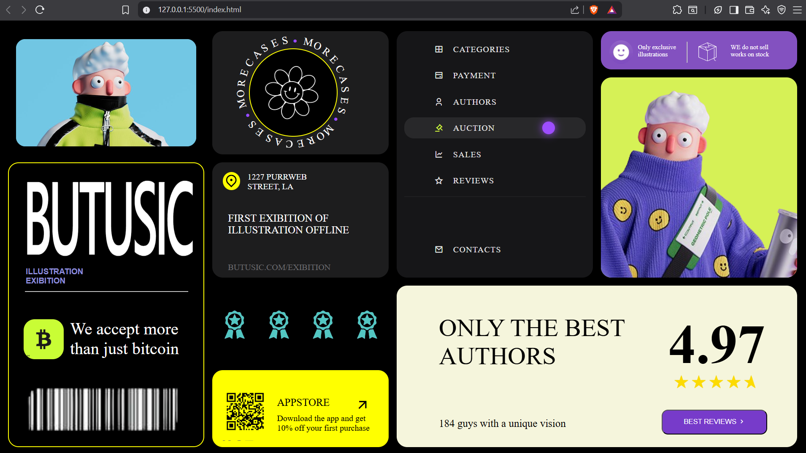

# Sidebar Navigation UI

A modern dark-themed landing page built using HTML and CSS.

## Technologies Used

- HTML5
- CSS3
- Remix Icons

## Folder Structure

```bash
project-folder/
│
├── index.html
├── style.css
└── assets/
```

## How to Run

1. Download the project
2. Open the folder in VS Code
3. Run `index.html` using Live Server

## Screenshot





## Author

Priyanshu Goyal
